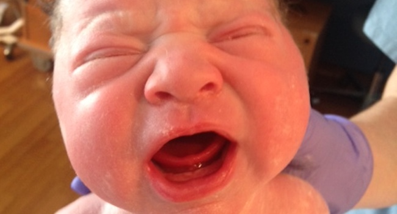
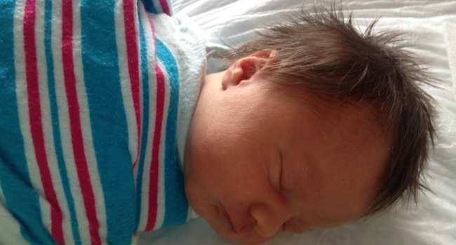
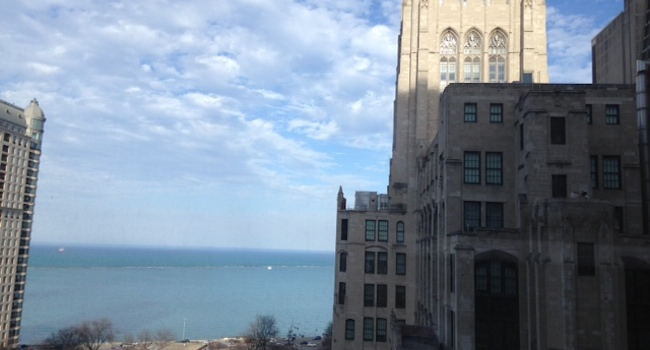
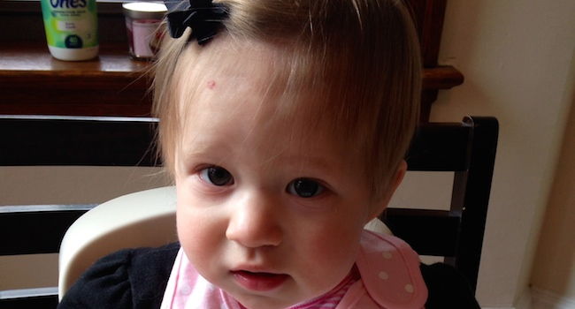
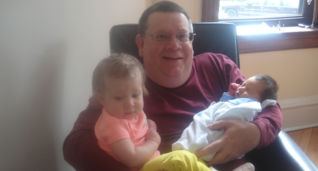

<!DOCTYPE html>
<html lang="en">

<head>

    <meta charset="utf-8">
    <meta http-equiv="X-UA-Compatible" content="IE=edge">
    <meta name="viewport" content="width=device-width, initial-scale=1">
    <meta name="description" content="">
    <meta name="author" content="">

    <title>Stone William is here</title>

    <!-- Bootstrap Core CSS -->
    <link rel="stylesheet" href="css/bootstrap.min.css" type="text/css">

    <!-- Custom Fonts -->
    <link href='http://fonts.googleapis.com/css?family=Open+Sans:300italic,400italic,600italic,700italic,800italic,400,300,600,700,800' rel='stylesheet' type='text/css'>
    <link href='http://fonts.googleapis.com/css?family=Merriweather:400,300,300italic,400italic,700,700italic,900,900italic' rel='stylesheet' type='text/css'>
    <link rel="stylesheet" href="font-awesome/css/font-awesome.min.css" type="text/css">

    <!-- Plugin CSS -->
    <link rel="stylesheet" href="css/animate.min.css" type="text/css">

    <!-- Custom CSS -->
    <link rel="stylesheet" href="css/creative.css" type="text/css">

    <!-- HTML5 Shim and Respond.js IE8 support of HTML5 elements and media queries -->
    <!-- WARNING: Respond.js doesn't work if you view the page via file:// -->
    <!--[if lt IE 9]>
        
        
    <![endif]-->

</head>

<body id="page-top">
 
    <nav id="mainNav" class="navbar navbar-default navbar-fixed-top">
        

            <!-- Brand and toggle get grouped for better mobile display -->
            

                <button type="button" class="navbar-toggle collapsed" data-toggle="collapse" data-target="#bs-example-navbar-collapse-1">
                    Toggle navigation
                    
                    
                    
                </button>
              <!--  <a class="navbar-brand page-scroll" href="#page-top">Start Bootstrap</a> -->
            

            <!-- Collect the nav links, forms, and other content for toggling -->
            

                <ul class="nav navbar-nav navbar-right">
                    <li>
                        <a class="page-scroll" href="#">Welcome</a>
                    </li>
                    <li>
                        <a class="page-scroll" href="#services">Details</a>
                    </li>
                    <li>
                        <a class="page-scroll" href="#portfolio">Photos</a>
                    </li>
               <!--     <li>
                        <a class="page-scroll" href="#contact">Contact</a>
                    </li> -->
                </ul>
            

            <!-- /.navbar-collapse -->
        

        <!-- /.container-fluid -->
    </nav>

    <header>
        

            

                <h1>Welcome to the team, Stone William Janzen!</h1>
                

                <a href="#about" class="btn btn-primary btn-xl page-scroll">Find Out More</a>
            

        

    </header>

    <section class="bg-primary" id="about">
        

            

                

                    <h2 class="section-heading">How it all started</h2>
                    

                    
Click here to watch the conception.  Just kidding!  But seriously, we decided to have another (no not a drink) after our perfect angel Racine started sleeping trough the night at 2.5 months.

                    <a href="#services" class="btn btn-default btn-xl">Details</a>
                

            

        

    </section>

    <section id="services">
        

            

                

                    <h2 class="section-heading">The details</h2>
                    

                

            

        

        

            

                

                    

                        <i class="fa fa-4x fa-diamond wow bounceIn text-primary"></i>
                        <h3>A textbook pregnancy</h3>
                        
Minus a few low platets, the pregancy was uneventful

                    

                

                

                    

                        <i class="fa fa-4x fa-paper-plane wow bounceIn text-primary" data-wow-delay=".1s"></i>
                        <h3>Wake up Rand...</h3>
                        
At 4am, again, Triss woke up Randy and said 'it's go time'!

                    

                

                

                    

                        <i class="fa fa-4x fa-newspaper-o wow bounceIn text-primary" data-wow-delay=".2s"></i>
                        <h3>10 days early</h3>
                        
Stone was born 6lbs 12oz at 11:41 on April 15th, yea tax day!

                    

                

                

                    

                        <i class="fa fa-4x fa-heart wow bounceIn text-primary" data-wow-delay=".3s"></i>
                        <h3>Surrounded by Love</h3>
                        
Grandparents greeted Stone at Prentice with a lake view!

                    

                

            

        

    </section>

    <section class="no-padding" id="portfolio">
        

            

                

                    <a href="#portfolio" class="portfolio-box">
                        
                        

                            

                                

                                    Hello World!
                                

                                

                                    Stone's first breath
                                

                            

                        

                    </a>
                

                

                    <a href="#portfolio" class="portfolio-box">
                        
                        

                            

                                

                                    Mom and Stone
                                

                                

                                    She did this twice in 12.5 months!
                                

                            

                        

                    </a>
                

                

                    <a href="#portfolio" class="portfolio-box">
                        
                        

                            

                                

                                    The hair
                                

                                

                                    Same do as daddy
                                

                            

                        

                    </a>
                

                

                    <a href="#portfolio" class="portfolio-box">
                        
                        

                            

                                

                                    The view
                                

                                

                                    Our lovely lake
                                

                            

                        

                    </a>
                

                

                    <a href="#portfolio" class="portfolio-box">
                        
                        

                            

                                

                                    Big sis
                                

                                

                                    She is still the boss
                                

                            

                        

                    </a>
                

                       

                    <a href="#portfolio" class="portfolio-box">
                        
                        

                            

                                

                                    More hair
                                

                                

                                    "The Donald"
                                

                            

                        

                    </a>
                

                

                    <a href="#portfolio" class="portfolio-box">
                        
                        

                            

                                

                                    'Quality Control'
                                

                                

                                    The pump passed the test
                                

                            

                        

                    </a>
                

                                       

                    <a href="#portfolio" class="portfolio-box">
                        
                        

                            

                                

                                    Grandpa Schultz
                                

                                

                                    
                                

                            

                        

                    </a>
                

                

                    <a href="#portfolio" class="portfolio-box">
                        
                        

                            

                                

                                    Papa Janzen
                                

                                

                                    
                                

                            

                        

                    </a>
                

 
                

                    <a href="#portfolio" class="portfolio-box">
                        
                        

                            

                                

                                    Rooster
                                

                                

                                    
                                

                            

                        

                    </a>
                
             

            

        

    </section>
    
    
 Watch us bring the little guy home!<video width="650" height="350" controls>
    <source src="homecomming.mp4" type="video/mp4">
    Your browser does not support the video tag.
    </video>

  

    <section id="contact">
        

            

                

                    <h2 class="section-heading">Thank you!</h2>
                    

                    
 We have the best friends and family thanks again for all your support along the way!

                

                

                    <i class="fa fa-phone fa-3x wow bounceIn"></i>
                    
312-476-9822

                

                

                    <i class="fa fa-envelope-o fa-3x wow bounceIn" data-wow-delay=".1s"></i>
                    
<a href="mailto:randy.janzen@gmail.com">randy.janzen@gmail.com</a>

                

            

        

    </section>

    <!-- jQuery -->
    

    <!-- Bootstrap Core JavaScript -->
    

    <!-- Plugin JavaScript -->
    
    
    

    <!-- Custom Theme JavaScript -->
    

</body>

</html>
